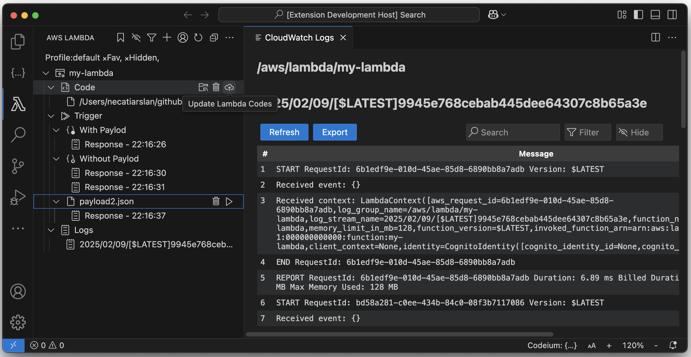

# AWS Lambda Extension for VSCode


🚀 **AWS Lambda Extension for VSCode** allows you to interact with your AWS Lambda functions directly within VSCode. This extension streamlines the development, testing, and debugging of Lambda functions, providing an intuitive interface for managing Lambda functions, environment variables, tags, code, logs, and more—all within your favorite code editor.

## ✨ Features

### 🎯 Lambda Function Management
- **Add/Remove Lambda Functions**: Easily add Lambda functions to your workspace and manage them
- **Trigger Lambda Functions**: Run your AWS Lambda functions with or without payloads
- **Manage Payloads**: Save and reuse JSON payloads for testing
- **Multiple AWS Profiles**: Work with multiple AWS profiles seamlessly
- **Filter & Search**: Find Lambda functions quickly with built-in filtering

### 📝 Environment Variables Management **NEW!**
- **View All Variables**: See all Lambda environment variables in a tree view
- **Add Variables**: Create new environment variables with ease
- **Update Variables**: Modify existing environment variable values
- **Remove Variables**: Delete environment variables with confirmation
- **Real-time Sync**: Changes sync immediately with AWS Lambda

### 🏷️ Tags Management **NEW!**
- **View All Tags**: Display all Lambda tags as expandable nodes
- **Add Tags**: Create new tags with key-value pairs
- **Update Tags**: Modify existing tag values
- **Remove Tags**: Delete tags with confirmation
- **Organization**: Keep your Lambda functions organized with tags

### ℹ️ Lambda Information **NEW!**
View detailed Lambda configuration in a convenient tree structure:
- Description
- Runtime
- Function ARN
- Memory Size
- Timeout
- State
- Last Modified
- Last Update Status
- Log Format
- Log Group
- Version

### 💾 Code Management
- **Download Lambda Code** **NEW!**: Download Lambda function code to your local machine
  - Smart workspace detection (saves to workspace root if available)
  - Auto-unzip functionality
  - Automatic code path setup for single files
  - Quick folder opening after download
- **Upload Code**: Upload and update your Lambda functions with ease
- **Set Code Path**: Point to local code for easy updates
- **Version Control**: Manage your Lambda code locally

### 📊 CloudWatch Logs
- **View Latest Logs**: Instantly access logs related to your Lambda executions
- **Log Streams**: Browse through multiple log streams
- **Export Logs**: Save logs for later analysis
- **Filter and Search**: Easily navigate through logs using built-in options

## 🎬 Quick Start

1. **Install the Extension**: Search for "AWS Lambda" in VSCode Extensions
2. **Configure AWS Credentials**: Set up your AWS credentials (see below)
3. **Add Lambda Function**: Click the `+` icon in the Lambda tree view
4. **Start Managing**: Download code, update environment variables, add tags, and more!

## 📋 New Features Walkthrough

### Environment Variables
```
1. Expand your Lambda function
2. Click "Environment Variables" node
3. Use inline icons to:
   - 🔄 Refresh variables
   - ➕ Add new variable
   - ✏️ Update existing variable
   - 🗑️ Remove variable
```

### Tags
```
1. Expand your Lambda function
2. Click "Tags" node
3. Use inline icons to:
   - 🔄 Refresh tags
   - ➕ Add new tag
   - ✏️ Update tag value
   - 🗑️ Remove tag
```

### Download Code
```
1. Expand your Lambda function
2. Click on "Code" node
3. Click ☁️ (download) icon
4. Choose location (workspace/downloads/custom)
5. Choose to unzip (recommended)
6. Auto-set code path (if single file detected)
7. Start editing locally!
```

## Sponsor Me
If you find this extension useful, you can [sponsor me on GitHub](https://github.com/sponsors/necatiarslan).

## AWS Endpoint URL
You can change your AWS endpoint URL to connect to LocalStack or other AWS-compatible services:
- Default: AWS Cloud
- LocalStack: `http://localhost:4566`
- Custom endpoint: Set via command palette

## AWS Credentials Setup
To access AWS, you need to configure AWS credentials.

For more details on AWS credentials:
- [AWS CLI Configuration Guide](https://docs.aws.amazon.com/cli/latest/userguide/cli-configure-files.html)
- [YouTube Tutorial](https://www.youtube.com/watch?v=SON8sY1iOBU)

### Supported Credential Sources
The extension searches for AWS credentials in the following order:

1. **Environment Variables**:
   - `AWS_ACCESS_KEY_ID`
   - `AWS_SECRET_ACCESS_KEY`
   - `AWS_SESSION_TOKEN` (optional, for temporary credentials)

2. **Shared Credentials File**:
   - `~/.aws/credentials` (default profile or a named profile)
   - `~/.aws/config` (for region settings)

3. **Amazon EC2 Instance Metadata Service (IMDS)**:
   - When running on an EC2 instance with an attached IAM role

4. **Amazon ECS Container Credentials**:
   - When running in an ECS task

5. **SSO Credentials**:
   - If you've configured SSO using the AWS CLI

6. **Web Identity Token**:
   - For federated identity access, such as AWS IAM roles for Kubernetes (EKS)

## 🐛 Bug Report & Feature Requests
To report bugs or request new features:
- [Create an Issue](https://github.com/necatiarslan/aws-lambda-vscode-extension/issues/new)

## 🗺️ Roadmap

### In Progress
- Share active profile with other extensions
- Stick to workspace and profile

### Future Ideas
- Lambda function creation from VSCode
- Inline code editing
- Advanced log filtering
- Performance metrics

## 📞 Connect

Follow me on LinkedIn for latest updates:
- [Necati Arslan on LinkedIn](https://www.linkedin.com/in/necati-arslan/)

**Thanks,**  
Necati ARSLAN  
necatia@gmail.com

## 🔗 Other Extensions

Check out my other AWS-related VSCode extensions:

- **[AWS S3](https://bit.ly/vscode-aws-s3)** – Interact with your AWS S3 buckets directly from VSCode.
- **[AWS Lambda](https://marketplace.visualstudio.com/items?itemName=NecatiARSLAN.aws-lambda-vscode-extension)** – Update, Trigger & Monitor your AWS Lambda Functions.
- **[AWS DynamoDB](https://marketplace.visualstudio.com/items?itemName=NecatiARSLAN.aws-dynamodb-vscode-extension)** – Manage & Monitor your AWS DynamoDB Tables - View table details, keys, capacity, indexes, and more.
- **[AWS SNS](https://marketplace.visualstudio.com/items?itemName=NecatiARSLAN.aws-sns-vscode-extension)** – Manage & Monitor & Push Messages to AWS SNS Topics.
- **[AWS SQS](https://marketplace.visualstudio.com/items?itemName=NecatiARSLAN.aws-sqs-vscode-extension)** – Interact with your AWS SQS Queues directly within VSCode.
- **[AWS Step Functions](https://marketplace.visualstudio.com/items?itemName=NecatiARSLAN.aws-step-functions-vscode-extension)** – Monitor and manage your Step Functions.
- **[AWS Access](https://bit.ly/aws-access-vscode-extension)** – Easily manage AWS credentials and profiles.
- **[AWS CloudWatch](https://bit.ly/aws-cloudwatch-vscode-extension)** – Monitor logs and metrics effortlessly.
- **[Apache Airflow](https://bit.ly/airflow-vscode-extension)** – Simplify Airflow DAG management and debugging.

---

**Made with ❤️ for the AWS Community**